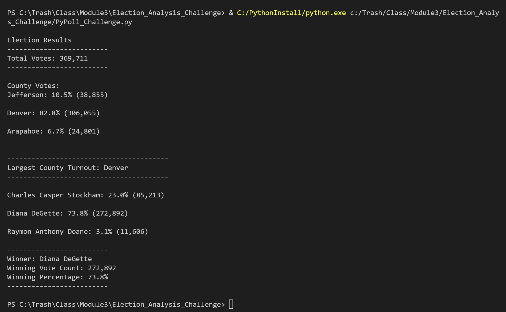
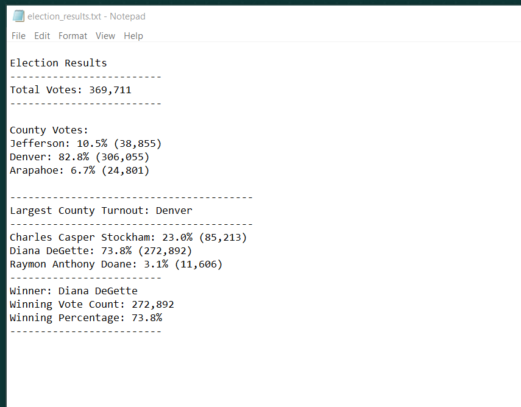

# Election_Analysis_Challenge
By David Matheny on 1/2/2021

## Overview of Election Audit:
The purpose of the election audit is to take in the results from election_results.csv to provide a terminal\text report of the results for audit purposes.  The results should be the total votes, votes by county, largest county turnout as well as votes by candidate(Winner and percentage).

## Election-Audit Results:
### How many votes were cast in this congressional election?
- 369,711 votes were cast in this congressional election.

### Provide a breakdown of the number of votes and the percentage of total votes for each county in the precinct.
- Jefferson: 10.5% (38,855)
- Denver: 82.8% (306,055)
- Arapahoe: 6.7% (24,801)

### Which county had the largest number of votes?
- Denver

### Provide a breakdown of the number of votes and the percentage of the total votes each candidate received.
- Charles Casper Stockham: 23.0% (85,213)
- Diana DeGette: 73.8% (272,892)
- Raymon Anthony Doane: 3.1% (11,606)

### Which candidate won the election, what was their vote count, and what was their percentage of the total votes?
- Winner: Diana DeGette
- Winning Vote Count: 272,892
- Winning Percentage: 73.8%

### Images of results
- Terminal image

- Text file image

## Election-Audit Summary:
